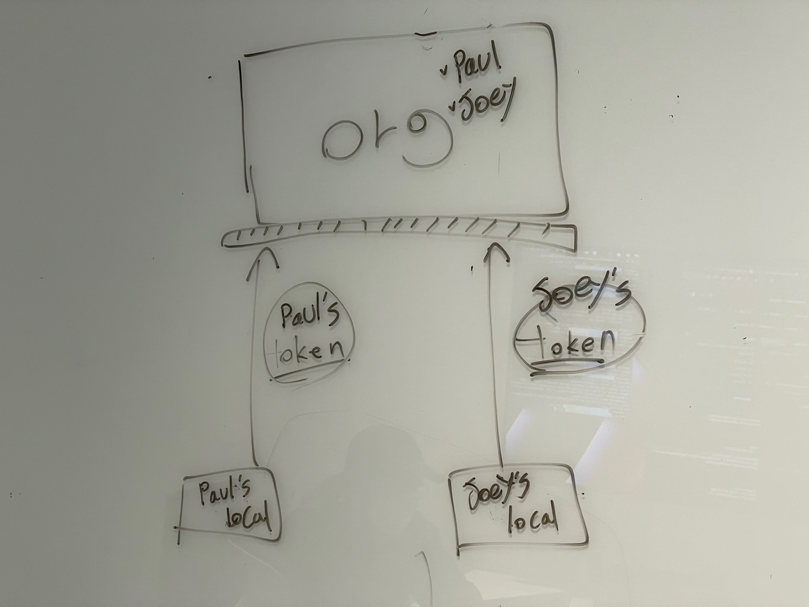
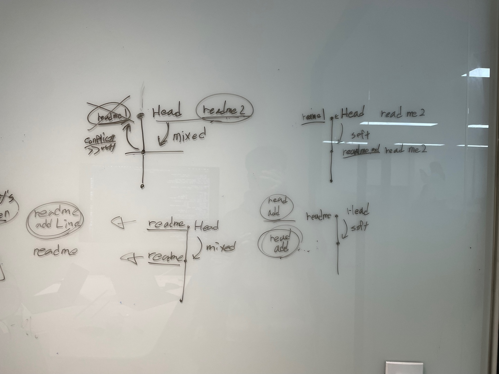

# 2022년 11월 22일

github에서 원격 저장소로 인증 요청을 하기위해서 기존엔 username/password 방식을 사용했으나 2021년 8월부터 지원하지 않게 되었다.

따라서 개인이 발급받은 Personal access token을 통해서 원격 저장소 접속 인증을 시도해야한다.

`git reset`은 특정 커밋으로 브랜치를 이동시킬 수 있는 명령어다. 기본적으로 `--mixed` 옵션이 default로 사용된다. (변경이 발생한 파일은 unstaged & working tree 유지)

