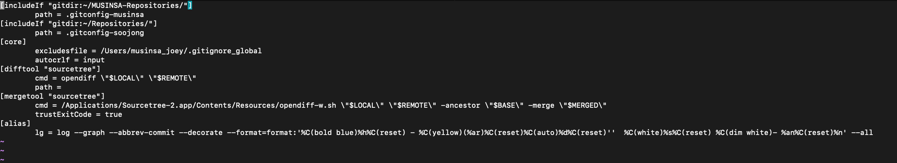
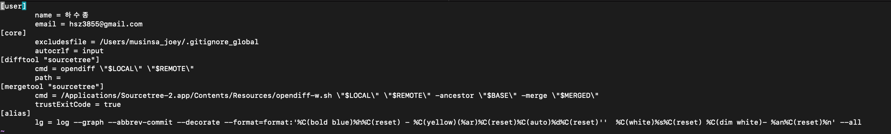

# 2022년 11월 29일

## git의 config를 directory 별로 관리하기

[여기 게시글](https://stackoverflow.com/questions/8801729/is-it-possible-to-have-different-git-configuration-for-different-projects)의 두번쨰 답변을 참고.

홈 디렉토리에 존재하는 `.gitconfig` 파일을 열어서 `includeIf` 구문을 작성하면 된다. 

`gitdir`은 config를 적용할 디렉토리를 작성한다.
`path`에는 gitdir에 적용할 config 파일을 지정해준다.

.gitconfig 파일 예시)

.gitconfig-soojong 파일 예시) 

