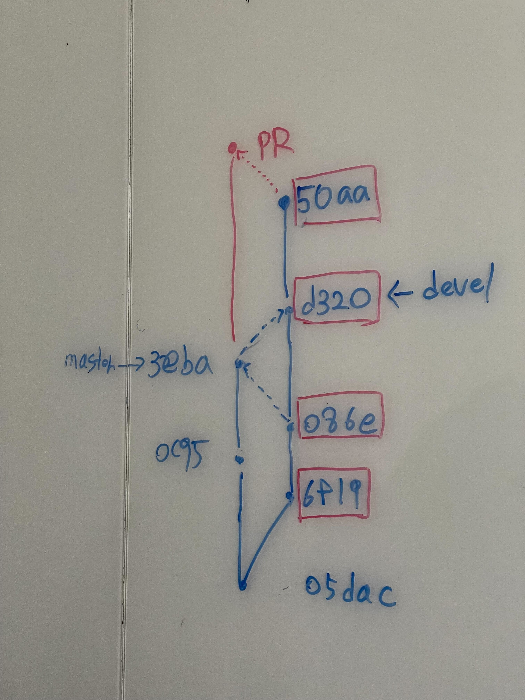
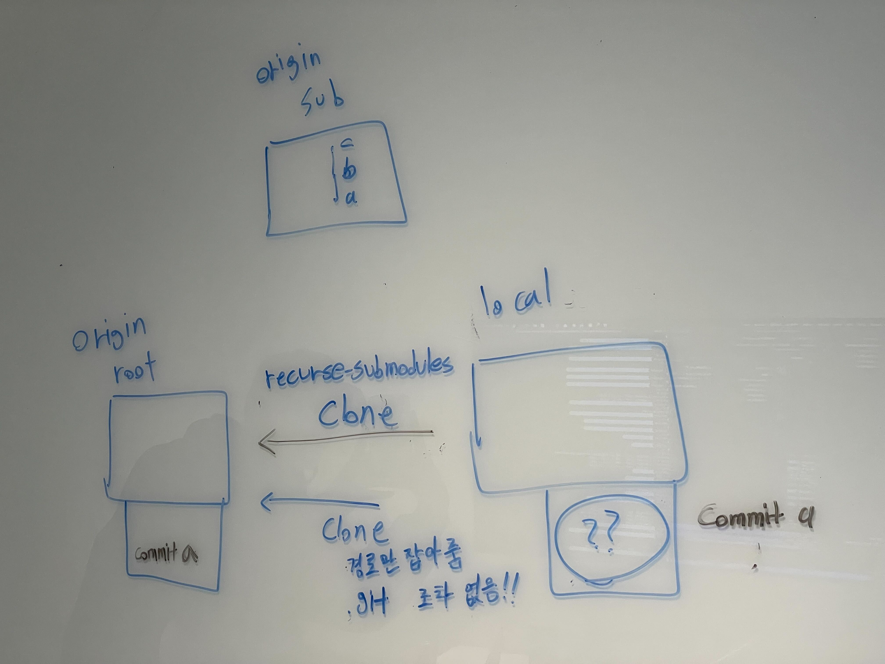
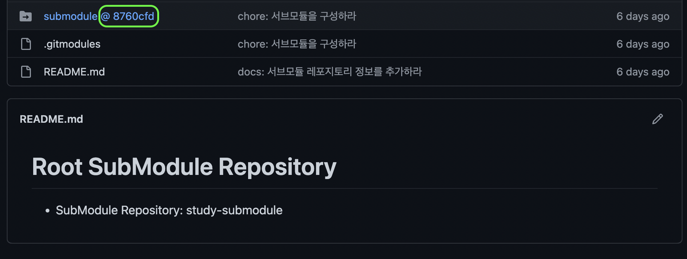

# 2022년 12월 13일

## Squash Commit

1. 05dac 커밋을 기준으로 devel 브랜치가 6f19, 086e 커밋을 만든다
2. master 브랜치는 0c95 커밋을 만든다.
3. devel이 master로 Squash Merge를 수행하며, 그결과 3eba 커밋이 생성된다.
4. main이 devel로 역머지되어 d320 커밋을 만든다.
5. devel은 d320을 기준으로 50aa 커밋을 만든다. 
6. devel은 master로 PR을 날린다.
7. 이때 PR 요청 내역에 출력되는 commit은 무엇일까?

결과적으로 아래 사진의 붉은색 박스의 commit들이 모두 출력된다. 소스코드상으론 6f19와 0862 커밋의 내용은 master에 이미 반영되어 있다.

하지만 브랜치는 commit 기준으로 이력을 관리하기 때문에 master 입장에선 086e, 6f19 커밋은 자신과 전혀 관계가 없는 것으로 판단한다.

이렇게 된 이유는 devel에서 master로 Merge시에 Squash Merge를 수행하면 6f19, 086e 커밋을 하나의 커밋(3eba)으로 합친후 Merge하기 때문이다. 

물론 Merge Commit을 하더라도 신규 Commit이 생성되긴 하지만, 그 때는 3eba의 부모 commit이 2개(0c95, 086e)이므로 086e와 0c95 양쪽 모두 트래킹이 가능하다.
하지만 Squash Merge의 경우도 신규 Commit이 하나 생성되긴 하지만 부모 Commit은 0c95 하나만 가지게 된다. 즉, 086e는 트래킹 하지 못한다.

## Submodule

1. Root Repository를 생성한다.
2. Sub Repository를 생성한다.
3. Sub Repository에 Commit a를 추가한다.
4. Root Repository에 Sub Repository를 서브모듈로 추가한다.
5. Sub Repository에 Commit b, Commit c를 추가한다.
6. 로컬에서 Root Repository를 Clone(or --recurse-submodules)했을 때 서브모듈의 커밋이력을 어떻게 될까?

첫번째로 로컬에 `--recurse-submodules` 옵션 없이 Root Repository를 Clone 시 서브모듈에 대한 경로만 잡혀있고 콘텐츠가 비어있었다. 또한 `.git` 파일이 없어 서브모듈없이 Root Repository만 클론된 것을 확인했다.

두번째로 로컬에서 `--recurse-submodules` 옵션을 이용해 Root Repository를 Clone 시 서브모듈과 같이 루트 레포지토리를 구성했다. 그런데 서브모듈 커밋 이력을 확인하니 Commit a만 존재하고, Commit b / Commit c 가 없었다.

그 이유는 Root Repository를 실제 github로 접속했을 때 서브모듈 경로를 확인하면 디렉토리에 커밋 이력과 같이 관리되는 것을 알 수 있다. 

즉, Root Repository 서브모듈의 커밋 이력은 Sub Repository 최신이력을 따라가는 것이 아니라, Root Repository의 커밋 이력을 따라간다.

