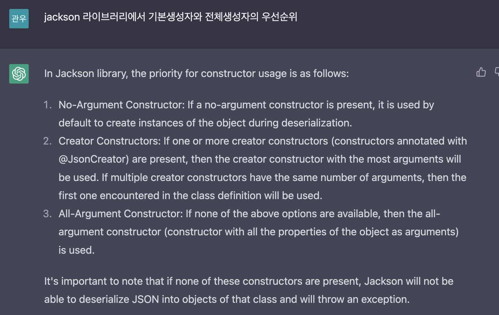
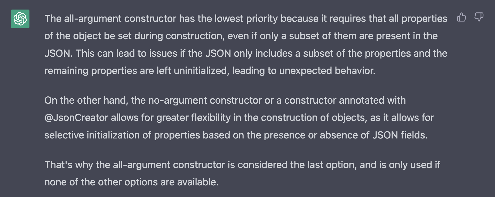

# 2023년 02월 1일

# 1. HTTP Request Body와 Java Object 매핑하기
## 1) Getter 만 있는경우(기본생성자만 있는경우) 
- Default가 적용된다.

## 2) @Builder 가 적용되어 있는 경우(전체 생성자만 있는 경우)
- Default 세팅 자체가 불가능함

## 3) 기본생성자와 전체 생성자가 함께 있는 경우
- Default가 적용된다.

## 4) 기본생성자와 전체 생성자, @Builder가 있는 경우
- Default가 적용된다.

## 참고자료
- Jackson을 통해 Json을 Object로 바인딩할때 기본생성자를 통해서 인스턴스를 생성하고 필드 매핑을 한다.
- 전체 생성자는 가장 후순위로 Jackson이 사용하기 때문에 기본생성자와 전체 생성자가 함께 있는 경우에도 기본 생성자를 통해서 필드 매핑을 수행한다.

