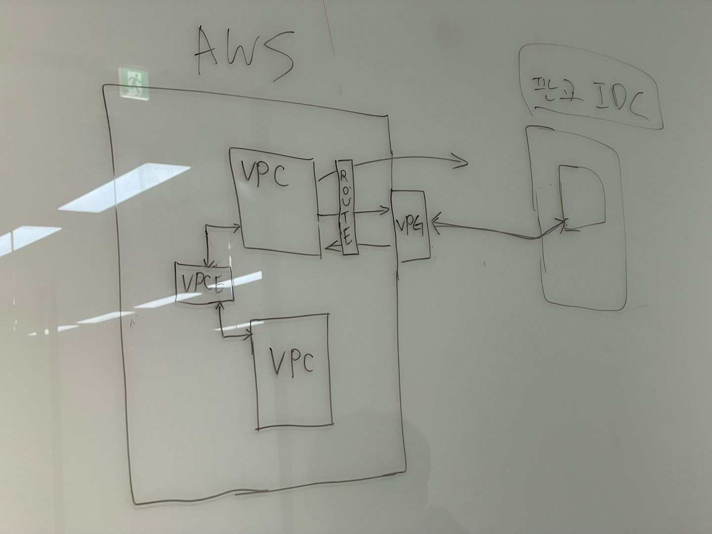

# 2023년 02월 14일

## AWS의 Route table
- https://docs.aws.amazon.com/vpc/latest/userguide/VPC_Route_Tables.html#route-tables-priority

라우팅 테이블 중복정책 처리방법
- 요청 IP가 2개 이상의 Destination에 포함될때 더 구체적(specific)으로 정의된 Destination의 Target으로 라우팅 된다.

VPCE와 VPG의 차이
